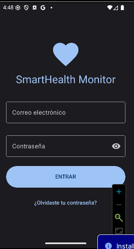
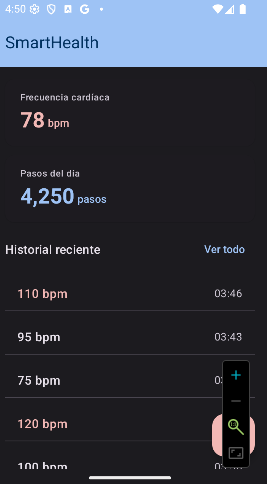
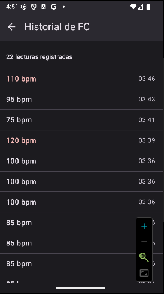
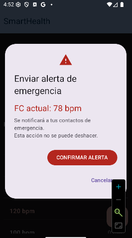
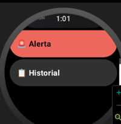
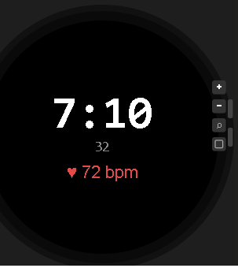
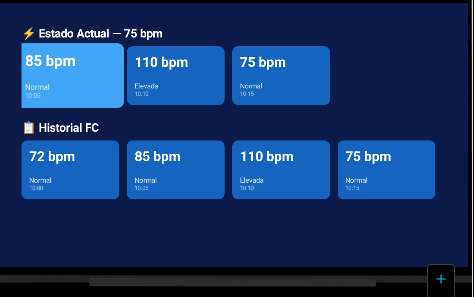
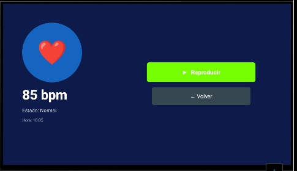
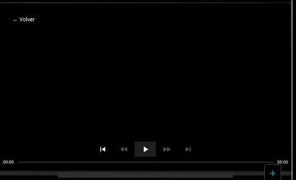

# SmartHealth Monitor


Aplicación Android de monitoreo de salud personal en tiempo real. Desarrollada como proyecto integrador — UTNG 9° Cuatrimestre.

---

## 📱 Dispositivos Soportados

| Dispositivo | Estado | Mínimo |
|-------------|--------|--------|
| **Teléfono** | ✅ Completo | API 26 |
| **Wear OS** | ✅ Completo | API 30 |
| **Android TV** | ✅ Completo | API 21 |
| **Chromecast** | ✅ Completo | - |

---

## 🏗️ Arquitectura — SmartHealth Monitor
┌─────────────────────────────────────────────────────────────────────────────┐
│ WEAR OS │
│ ┌─────────────────────────────────────────────────────────────────────┐ │
│ │ Sensor PPG (Health Services API) │ │
│ │ │ │ │
│ │ ▼ │ │
│ │ PassiveListenerService (wear) │ │
│ │ │ MessageClient (BLE) │ │
│ └────┼────────────────────────────────────────────────────────────────┘ │
│ │ │
│ ▼ │
├─────────────────────────────────────────────────────────────────────────────┤
│ APP (Teléfono) │
│ ┌─────────────────────────────────────────────────────────────────────┐ │
│ │ WearListenerService (app) │ │
│ │ │ SmartHealthRepository │ │
│ │ ▼ │ │
│ │ StateFlow<Int> (fcActual) ─────────────────────────────────┐ │ │
│ │ │ │ │ │
│ │ ▼ ▼ │ │
│ │ DashboardViewModel (app) TvViewModel (tv)│ │
│ │ │ collectAsState() │ collectAsState()│
│ │ ▼ ▼ │ │
│ │ DashboardScreen (Compose) TvCatalogScreen │ │
│ │ └── CastButton ──► Chromecast (Remote Playback) │ │
│ │ │ │
│ │ Room DB (LecturaFC) ◄── Repository ──► Flow<List<LecturaFC>> │ │
│ │ │ │ │
│ │ ┌─────────────────────┴──────────┐ │ │
│ │ ▼ ▼ │ │
│ │ HistorialScreen (app) TvCatalogScreen (tv) │ │
│ └─────────────────────────────────────────────────────────────────────┘ │
└─────────────────────────────────────────────────────────────────────────────┘

---

## 📦 Stack tecnológico

| Tecnología | Uso |
| :--- | :--- |
| **Kotlin + Jetpack Compose** | UI declarativa con Material Design 3 |
| **Wearable Data Layer API** | Comunicación reloj ↔ teléfono (BLE) |
| **Health Services API** | Sensor FC real en background (Wear OS) |
| **Room Database** | Historial persistente de lecturas FC |
| **Jetpack Navigation** | NavHost entre las pantallas de la aplicación |
| **ExoPlayer** | Reproducción de video en Android TV |
| **Google Cast SDK** | Transmisión a Chromecast |
| **GitHub + Conventional Commits** | Control de versiones profesional |

---

## 📱 Pantallas

### 📱 App (Teléfono)

| Pantalla | Descripción |
| :--- | :--- |
| **LoginScreen** | Autenticación con validación de campos y estados de carga |
| **DashboardScreen** | Visualización de FC y Pasos en tiempo real provenientes del wearable con botón de pánico y CastButton |
| **HistorialScreen** | Listado de lecturas persistidas en Room DB mediante el uso de Flow reactivo |
| **AlertaScreen** | Diálogo emergente (AlertDialog MD3) con spinner de carga y Snackbar de confirmación |

### ⌚ Wear OS

| Pantalla | Descripción |
|---|---|
| **WearDashboardScreen** | FC en tiempo real con ScalingLazyColumn y TimeText |
| **WearHistorialScreen** | Lista con Rotary Input (corona del reloj) |
| **WearAlertaScreen** | Botones circulares de confirmación |
| **SmartHealth WatchFace** | Hora + FC en el WatchFace nativo |

### 📺 Android TV

| Pantalla | Descripción |
|---|---|
| **TvCatalogScreen** | Dos filas de cards navegables con D-pad |
| **TvDetailScreen** | Detalle de lectura con botones focusables |
| **TvPlaybackScreen** | Reproductor con ExoPlayer + AndroidView |

---

## 📸 Capturas de pantalla

### Login


### Dashboard


### Historial


### Alerta de Emergencia


### Wear Dashboard


### WatchFace


### TvCatalogScreen



El catálogo muestra dos filas de cards:
- **⚡ Estado Actual**: Muestra las últimas 3 lecturas con su FC, estado y hora
- **📋 Historial FC**: Muestra todas las lecturas guardadas en Room

La navegación se realiza completamente con el D-pad del control remoto. Al presionar OK sobre una card, se navega a la pantalla de detalle.

### TvDetailScreen



La pantalla de detalle muestra:
- **Panel izquierdo**: Icono de corazón, valor de FC (bpm), estado y hora de la lectura
- **Panel derecho**: Botones de acción focusables
    - ▶ **Reproducir**: Navega al reproductor de video
    - ← **Volver**: Regresa al catálogo

El foco automáticamente se posiciona en el botón "Reproducir" al entrar a la pantalla.

### TvPlaybackScreen



El reproductor utiliza ExoPlayer integrado con Compose mediante AndroidView:
- Reproducción de video en streaming
- Controles de reproducción (Play/Pause, Seek)
- Botón "← Volver" en la esquina superior izquierda
- Liberación automática de ExoPlayer al salir de la pantalla (DisposableEffect)


---

## 📋 Versiones y Tags

| Tag | Descripción |
|-----|-------------|
| **v1.0.0** | Base de datos Room + Repository |
| **v1.1.0** | Wear OS con Health Services |
| **v1.2.0** | Comunicación App-Wear + WatchFace |
| **v2.0.0** | Android TV con Compose for TV |
| **v2.1.0** | TV Detail y Playback con ExoPlayer |
| **v2.2.0** | Chromecast Cast SDK + README |

---

## 🔧 Instalación

1. Clonar el repositorio
```bash
git clone https://github.com/gutierrezvargasandy1/Desarrollo-para-dispositivos-Inteligentes.git